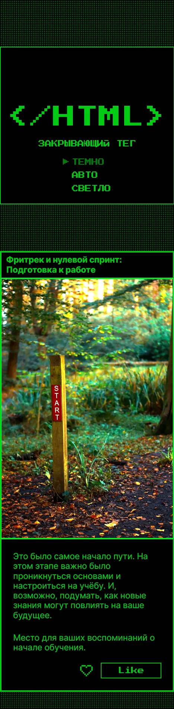
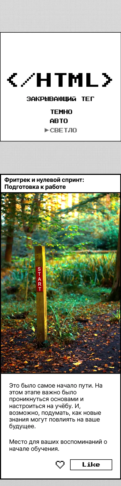
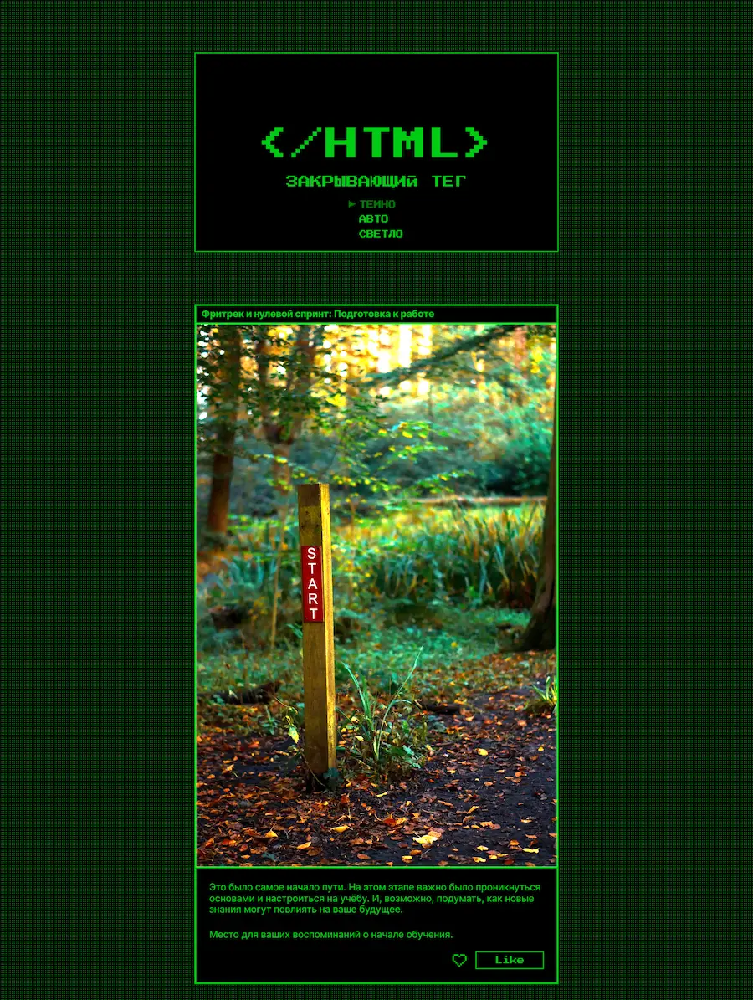
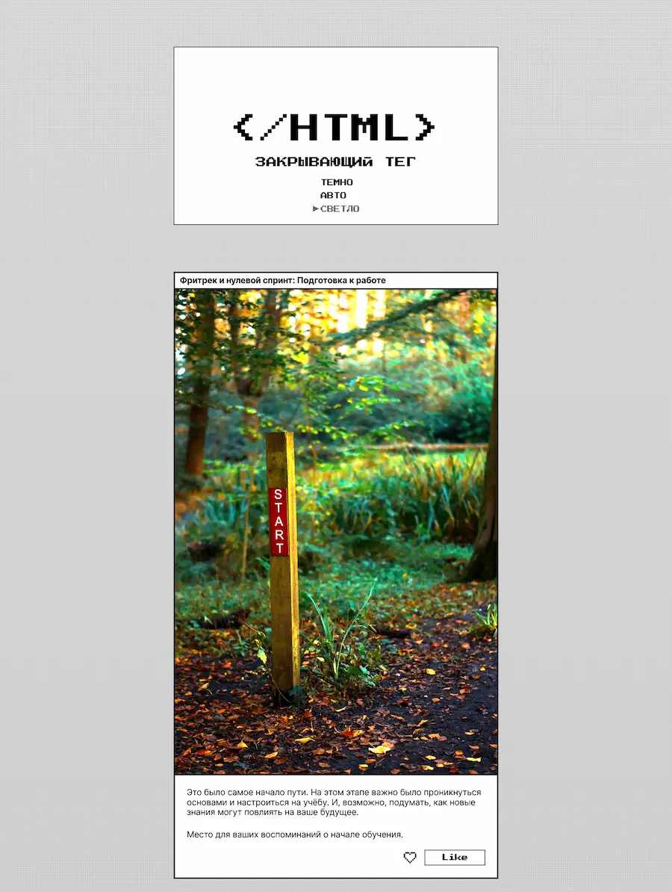

# Проектная работа "Закрывающий тег"

## Оглавление

- [Запуск](#запуск)
- [Скриншоты](#скриншоты)
- [Описание](#описание)
- [Автор](#автор)

### Запуск

```
git pull https://github.com/dezhlani/zakrivayuschiy-teg-ad
cd zakrivayuschiy-teg-ad
npm install
npm run dev
```

### Скриншоты






### Описание

Блог о пройденном пути в изучении веб-разработки, выполненный в светлой и тёмной теме. В данной работе упор был на анимации, в частности анимация сердца при нажатии кнопки like. 

Использованные технологии: Gulp, SCSS.

## Автор

- Github - [dezhlani](https://github.com/dezhlani)

Ссылка на опубликованный сайт: https://dezhlani.github.io/zakrivayuschiy-teg-ad/
